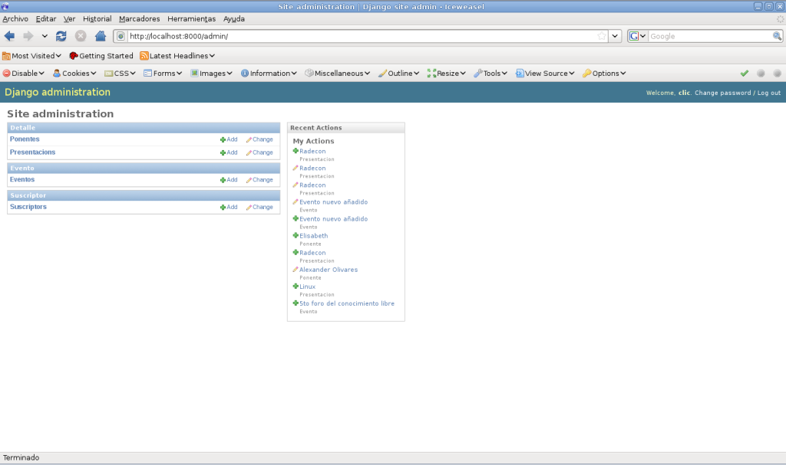
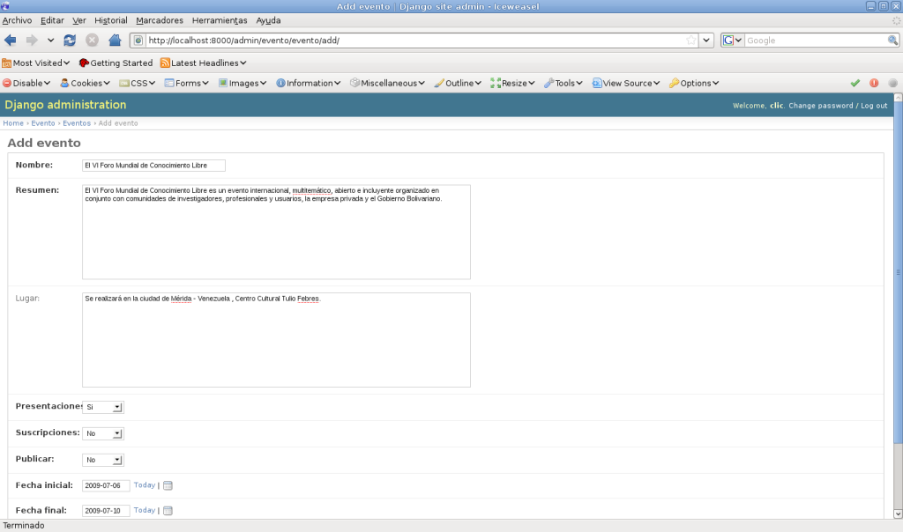
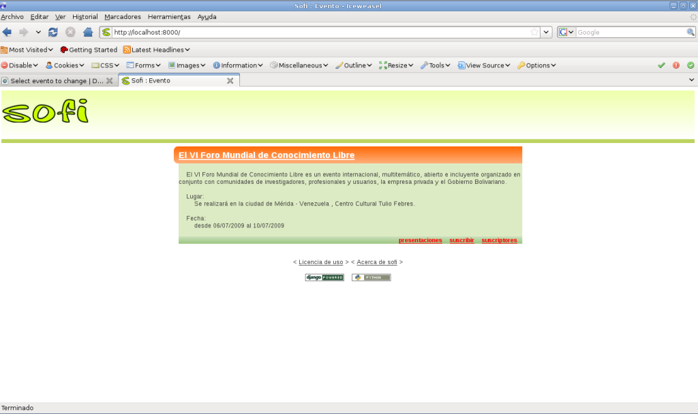
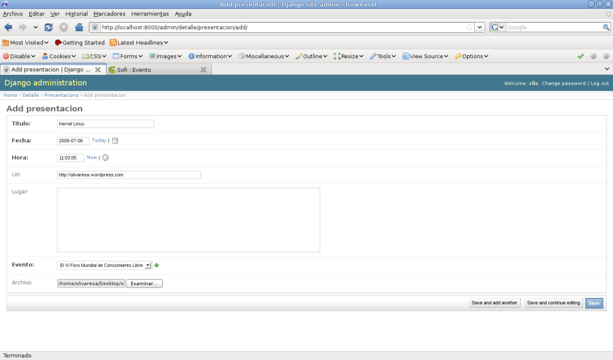
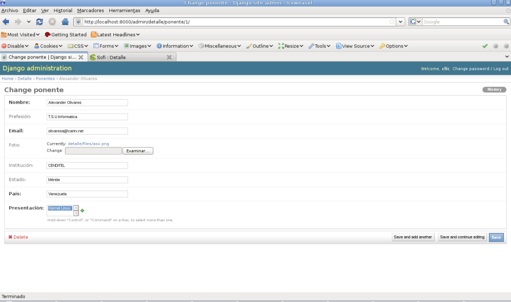
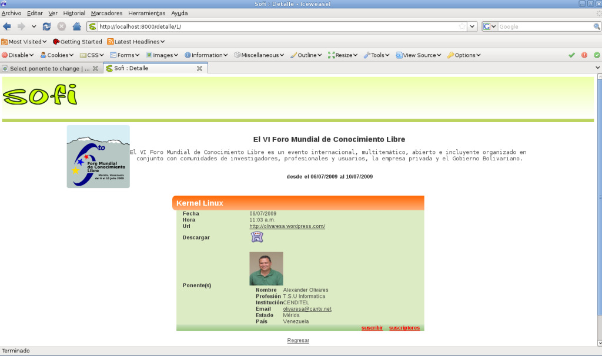
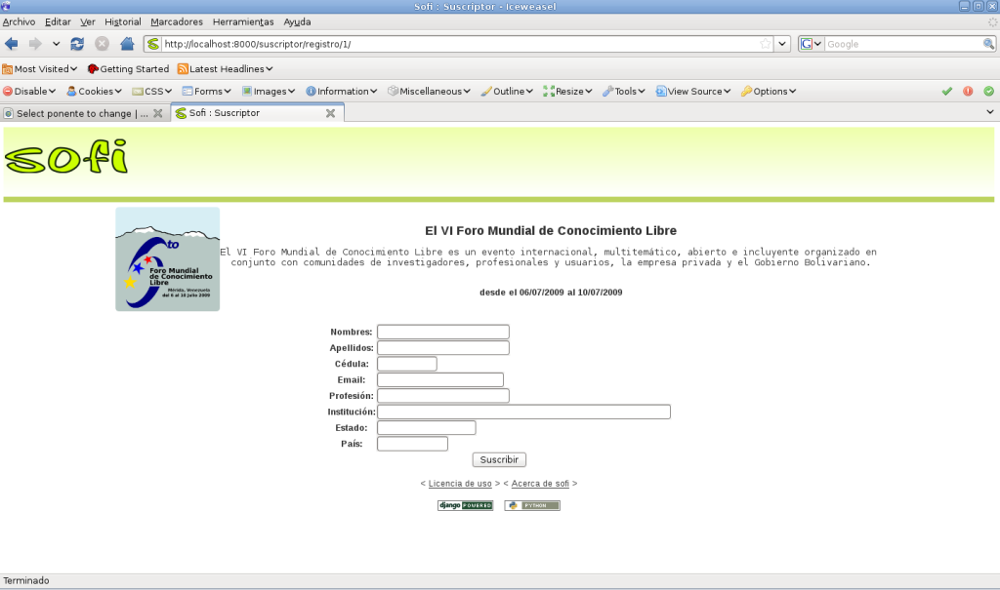

.. -*- coding: utf-8 -*-

.. _tutorial_sofi:

Tutorial de Sofi
================

:Autor(es): Leonardo J. Caballero G.
:Correo(s): leonardocaballero@gmail.com
:Lanzamiento: |version|
:Actualizado el: |today|

.. _inicio_sesion_sofi:

Este busca ser un recetario que permite conocer las funcionalidades básicas de Sofi.

Inicio de sesión
----------------
En este paso usted debe iniciar sesión de usuario dentro del sistema, 
inicialmente con el usuario que creo al momento de crear la base de datos
con Django.

.. figure::  ../capturas_pantalla/0.png
   :width: 1024px
   :alt: Iniciar sesión de usuario.
   :align: center

   Iniciar sesión de usuario.

.. _configuracion_sitio_sofi:

Luego de haber iniciado la sesión de usuario usted accede al panel de 
administración del sistema Sofi como se muestra a continuación:

   Panel de administración Sofi.

.. _registro_evento_sofi:

Registro de Evento
------------------

Ya iniciado sesión de usuario usted puede hacer clic en el enlace **Add** 
o **Añadir** del modulo Eventos para registrar un nuevo evento en el sistema Sofi.

   Registro de un Evento.

Luego de haber creado el nuevo evento usted puede ver como va quedando la ficha 
del evento registro como se muestra a continuación:

   Evento registrado.

.. _registro_presentacion_sofi:

Registro de presentación
------------------------
Una ves registrado un evento usted puede hacer clic en el enlace **Add** 
o **Añadir** del modulo ``Presentacions`` para registrar una nueva presentación 
disponible para el evento registrado en el sistema Sofi.

   Registro de una presentación.

.. _registro_ponente_sofi:

Registro de ponente
-------------------

Una ves registrado un evento usted puede hacer clic en el enlace **Add** 
o **Añadir** del modulo ``Ponentes`` para registrar un nuevo ponente a una 
presentación asociada a un evento registrado en el sistema Sofi.

   Registro de un ponente.

Nuevamente después de haber creado una nueva presentación y un nuevo ponente 
asociado a esta usted puede ver como va quedando la ficha del evento registro 
como se muestra a continuación:

   Ficha del evento básica, con una presentación y un ponente asociado

Si hace clic en enlace en la parte inferior derecha llamado **suscribir** puede 
acceder al formulario de registro de asistencia/participantes del evento como 
se muestra a continuación:

   Formulario de registro de participantes

